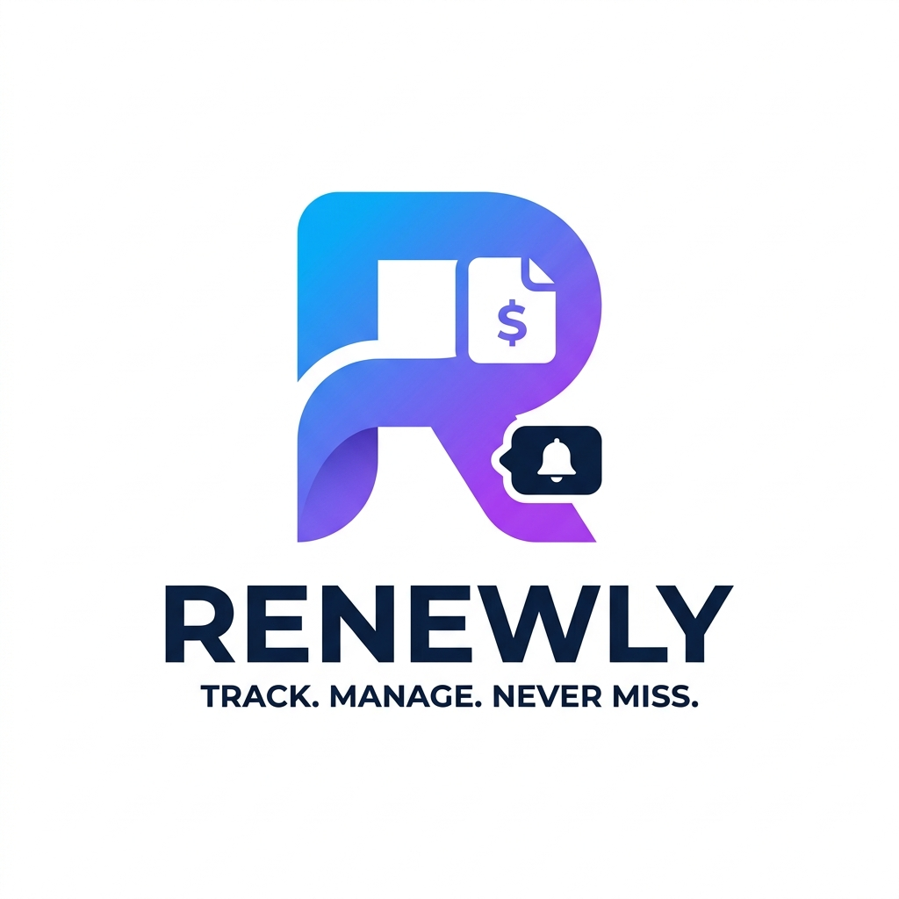

# Renewly

> A modern SaaS platform for managing digital subscriptions, recurring bills, and digital purchases.

## Overview
Renewly helps users manage subscriptions (Netflix, Prime Video, Spotify, ChatGPT, etc.), track recurring bills, monitor spending, receive renewal reminders, and track permanent digital purchases from platforms like Steam, Epic Games, PlayStation, and Xbox.

## Tech Stack
- **Frontend**: React, TypeScript, Vite, Tailwind CSS
- **Backend**: NestJS, TypeScript
- **Database**: PostgreSQL (Neon)
- **ORM**: Prisma
- **Validation**: Zod
- **Monorepo**: Turborepo

## Folder Structure
```text
renewly/
├── apps/
│   ├── web/               # React + Vite frontend
│   └── api/               # NestJS backend
├── packages/
│   ├── ui/                # Shared UI components
│   ├── validation/        # Shared Zod schemas
│   ├── config/            # Shared ESLint/Prettier configs
│   └── types/             # Shared TypeScript types
```

## Roadmap
- [ ] Project Foundation & Monorepo Setup
- [ ] Authentication Module
- [ ] Subscription CRUD & Provider Catalog
- [ ] Digital Purchase tracking
- [ ] Dashboard & Analytics
- [ ] Reminders Engine

## Getting Started
*(Coming Soon)*

## Contributing
See [CONTRIBUTING.md](./CONTRIBUTING.md) for details.

## License
MIT License

## Author
Piyush Tripathi
