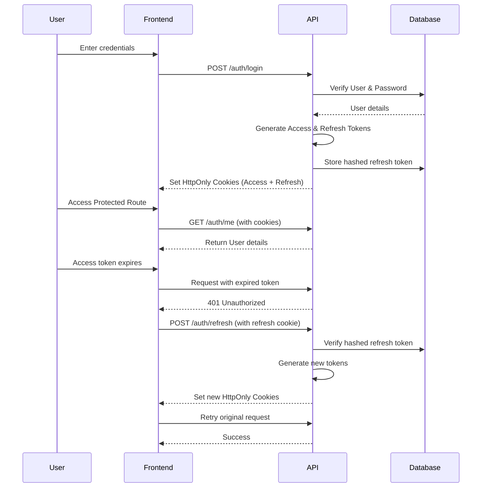

# Authentication Flow

## Sequence Diagram



## Environment Variables

Ensure the following environment variables are set in your `.env` files:

**API**
```env
JWT_ACCESS_SECRET=your_super_secret_access_key
JWT_REFRESH_SECRET=your_super_secret_refresh_key
FRONTEND_URL=http://localhost:5173
```

**Frontend**
```env
VITE_API_URL=http://localhost:3000
```

## API Documentation

### POST `/auth/register`
Creates a new user.
- **Body**: `{ email, password, name? }`

### POST `/auth/login`
Authenticates a user.
- **Body**: `{ email, password }`
- **Response**: Sets HttpOnly cookies.

### POST `/auth/refresh`
Refreshes the access token using the refresh token cookie.

### GET `/auth/me`
Returns the current authenticated user's details.

### POST `/auth/logout`
Logs out the user and clears cookies.
